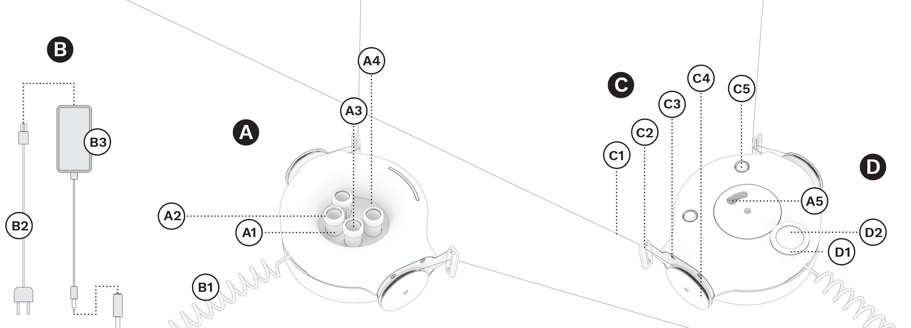

> https://web.archive.org/web/20240530212254/https://support.scribit.design/hc/en-us/articles/360025363531-Scribit-device-system

# Scribit device system

4 years ago Updated

****

**A. DRAWING SYSTEM**  
A1. pen holder  
A2. pen holder cap  
A3. marker slot  
A4. cylinder  
A5. pen nib hole

**B. POWER SUPPLY SYSTEM**  
B1. spiral cable  
B2. power cable  
B3. power adapter

**C. MOTION SYSTEM**  
C1. structural wire  
C2. wire tightener  
C3. wing  
C4. pulley  
C5. ball caster

**D. ERASING SYSTEM**  
D1. ceramic heater  
D2. ceramic holder
