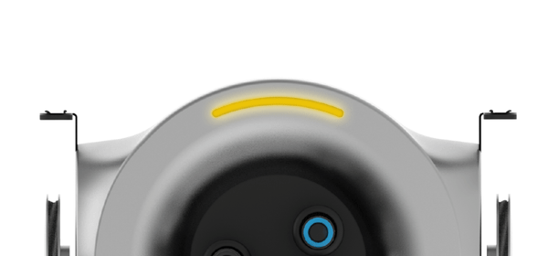

> https://web.archive.org/web/20220518041107/https://support.scribit.design/hc/en-us/articles/360023132811

# What the status lights (LED) mean

-   2 years ago
-   Updated

The LED on your Scribit Robot uses different colors and patterns to communicate the state of your Scribit Robot.

  
Here’s an overview:

#### **Linear-pulse White Light**

Scribit is ready to pair. Use the mobile App to continue the pairing flow.

#### **Solid White Light**

Scribit is in standby mode and connected to your network. If you’re already connected to Scribit, this means that Scribit is ready to start drawing.

#### **Double-blinking White Light**

The Scribit mobile App has sent a drawing to Scribit, he is in loading mode.  

#### **Linear-pulse Cyan light**

Scribit it is calibrating.

#### **Double-blinking Cyan light**

Scribit downloaded calibration process  

#### **Linear-pulse Orange light**

Scribit is reaching its temperature to start to erase your artwork.

#### **Solid Orange light**

Scribit is heating to start to erase your artwork on your wall.

#### **Double-blinking red light**

A system error/failure has occurred. Try unplugging Scribit and plugging it back in again.

If the problem persist please contact Scribit customer support

#### **Double-blinking yellow light**

A factory reset is in progress.

#### **Double-blinking blue light**

A firmware update has been downloaded to Scribit and is being installed. After the update has installed, Scribit will restart and show a solid white light.

#### ****

#### **Linear-pulse light**

Scribit is booting. This happens often after an unplug action, after that Scribit will restart and show a solid or a linear-pulse white light according to its connection status.  

####  

#### **Solid blue light**

Scribit firmware has been updated. After this Scribit will turn to a solid or a linear-pulse white light according to its connection status.  

####  

#### **Solid Red light**

Scribit had a connection/calibration failure. Usually after this Scribit will turn to a solid or a linear-pulse white light according to its connection status.  

If the problem persist please contact Scribit customer support

####  

#### **Solid Green light**

Scribit had a successfull connection/calibration.  

#### **Linear-pulse “rainbow light”**

Scribit is drawing.